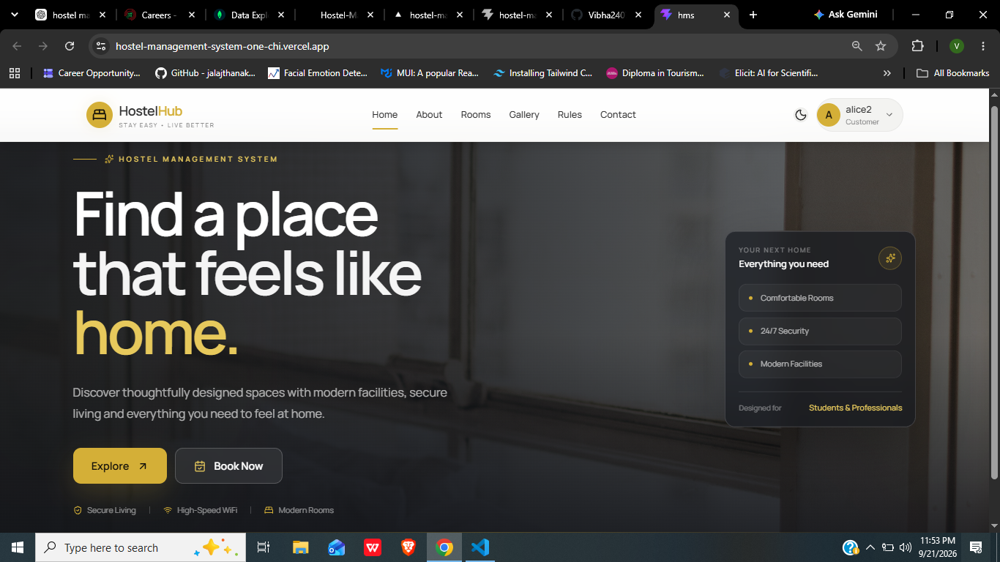
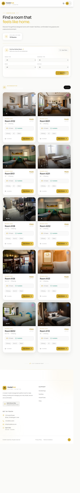
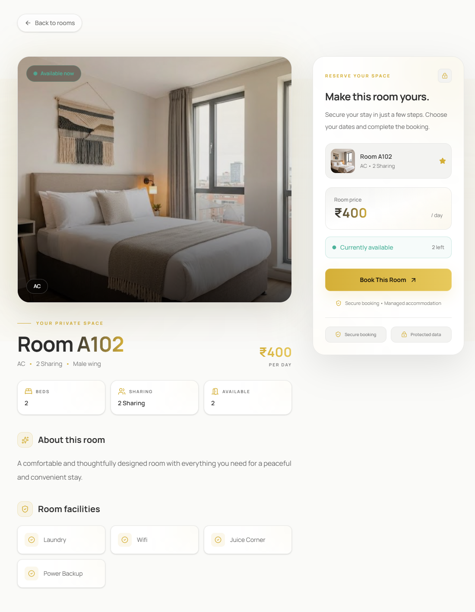
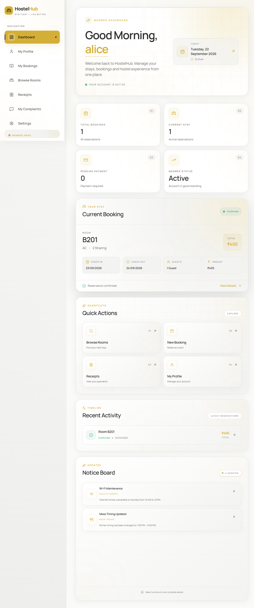
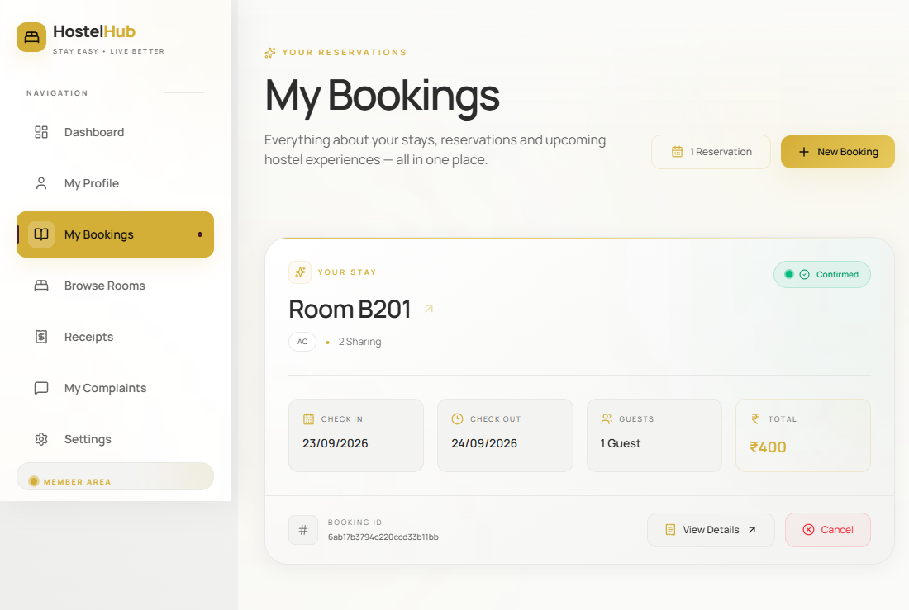
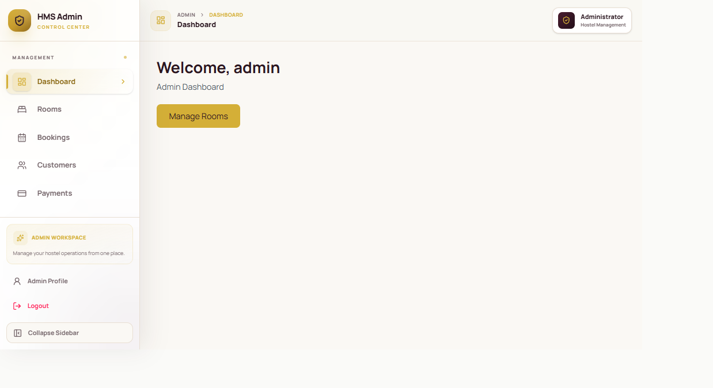
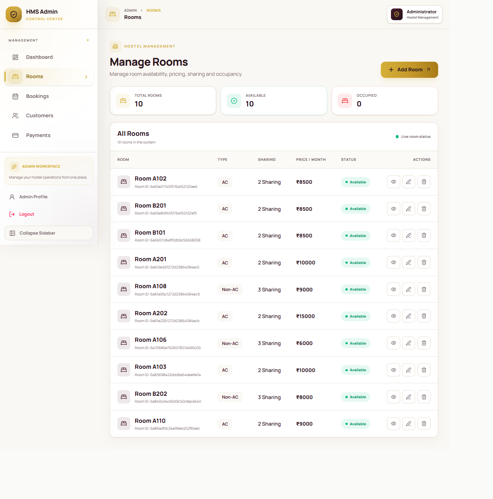
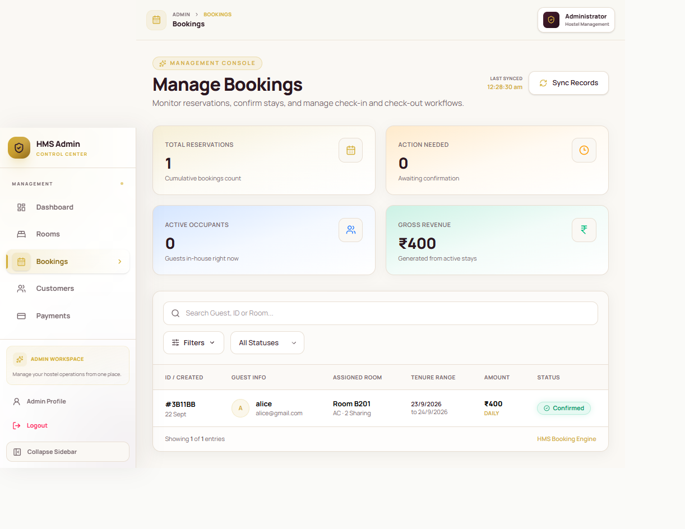

# 🏨 Hostel Management System

A full-stack web application for managing hostel operations, room bookings, customers, payments, complaints, facilities, and administrative activities through separate customer and admin interfaces.

## 🚀 Live Demo

**Frontend:** https://hostel-management-system-one-chi.vercel.app/

**Backend:** https://hostel-management-system-backend-jtwi.onrender.com/

---

## 📌 Overview

The Hostel Management System is a MERN-stack application designed to digitize common hostel management activities.

The application provides role-based access for **Customers** and **Administrators**, allowing customers to explore rooms, make bookings, manage their bookings and payments, submit complaints, and access receipts.

Administrators can manage rooms, bookings, customers, facilities, payments, complaints, and reports from a dedicated dashboard.

---

## ✨ Key Features

### 👤 Customer

- User registration and login
- Role-based authentication
- Customer dashboard
- Browse available rooms
- View detailed room information
- Room booking
- View and manage personal bookings
- Payment management
- Payment receipt generation
- Submit and manage complaints
- Profile management
- Account settings
- View hostel rules and facilities

### 👨‍💼 Admin

- Admin authentication
- Admin dashboard
- Room management
- Add new rooms
- Edit room details
- Manage room availability and pricing
- Booking management
- Customer management
- Payment management
- Complaint management
- Facility management
- Hostel rules management
- Reports and dashboard statistics
- Admin profile and settings

### 🌐 Public Pages

- Home

- About
- Rooms
- Room Details
- Gallery
- Rules
- Contact
- Privacy Policy
- Terms & Conditions
- 404 Not Found page

---

## 📸 Screenshots

### Home Page



### Rooms



### Room Details



### Customer Dashboard



### My Bookings



### Admin Dashboard



### Manage Rooms



### Manage Bookings



---

## 🛠️ Tech Stack

### Frontend

## 🛠️ Tech Stack

### Frontend

- **React**
- **Vite**
- **React Router**
- **Axios**
- **Tailwind CSS**
- **Material UI**
- **Framer Motion**
- **React Hook Form**
- **React Hot Toast**
- **Chart.js**
- **React PDF**
- **jsPDF**
- **Day.js**
- **Lucide React**
- **React Icons**

### Backend

- **Node.js**
- **Express.js**
- **MongoDB**
- **Mongoose**
- **JWT Authentication**
- **bcryptjs**
- **Cloudinary**
- **Multer**
- **Helmet**
- **CORS**
- **Cookie Parser**
- **node-cron**
- **PDFKit**

---

## 🔐 Authentication & Security

The application implements:

- JWT-based authentication
- HTTP-only authentication cookies
- Role-based authorization
- Password hashing using bcrypt
- Protected customer and admin routes
- CORS configuration for frontend/backend communication
- Helmet for HTTP security headers
- Environment variables for sensitive configuration

---

## 🗄️ Database Models

The backend uses MongoDB with Mongoose.

Main collections/models include:

- `User`
- `Room`
- `Booking`
- `Payment`
- `Complaint`
- `Facility`
- `Rule`

---

## 📂 Project Structure

```text
Hostel-Management-System/
│
├── client/
│   ├── src/
│   │   ├── assets/
│   │   ├── components/
│   │   ├── constants/
│   │   ├── context/
│   │   ├── hooks/
│   │   ├── layout/
│   │   ├── pages/
│   │   ├── routes/
│   │   ├── services/
│   │   ├── styles/
│   │   └── utils/
│   │
│   └── package.json
│
├── server/
│   ├── src/
│   │   ├── config/
│   │   ├── controller/
│   │   ├── middleware/
│   │   ├── models/
│   │   ├── routes/
│   │   ├── services/
│   │   ├── uploads/
│   │   └── utils/
│   │
│   └── package.json
│
├── .gitignore
├── package.json
└── README.md
```

---

## ⚙️ Local Installation

### 1. Clone the repository

```bash
git clone https://github.com/Vibha2407/Hostel-Management-System.git
cd Hostel-Management-System
```

### 2. Install frontend dependencies

```bash
cd client
npm install
```

### 3. Install backend dependencies

Open another terminal:

```bash
cd server
npm install
```

### 4. Configure environment variables

Create the required `.env` files for the backend and frontend.

Do not commit actual credentials, database passwords, JWT secrets, or API keys to GitHub.

### 5. Start the backend

```bash
cd server
npm run dev
```

### 6. Start the frontend

```bash
cd client
npm run dev
```

The frontend will normally run on the Vite development server.

---

## 🌍 Deployment

The application is deployed using:

- **Frontend:** Vercel
- **Backend:** Render
- **Database:** MongoDB Atlas
- **Cloud image storage:** Cloudinary

The production frontend communicates with the deployed backend through environment-based API configuration.

---

## 📊 Application Flow

```text
Customer
   │
   ├── Register / Login
   │
   ├── Browse Rooms
   │
   ├── View Room Details
   │
   ├── Book Room
   │
   ├── Make Payment
   │
   ├── View Receipt
   │
   └── Submit Complaint


Admin
   │
   ├── Login
   │
   ├── Dashboard
   │
   ├── Manage Rooms
   │
   ├── Manage Bookings
   │
   ├── Manage Customers
   │
   ├── Manage Payments
   │
   ├── Manage Complaints
   │
   ├── Manage Facilities
   │
   └── View Reports
```

---

## 🎯 Project Goals

The main goals of the project are to:

- Reduce manual hostel management work
- Centralize hostel information
- Simplify room booking and payment management
- Provide separate workflows for customers and administrators
- Improve visibility of hostel operations through dashboards and reports

---

## 🔮 Future Improvements

Possible future enhancements include:

- Online payment gateway integration
- Email/SMS notifications
- Advanced reporting and analytics
- Automated booking reminders
- More granular admin permissions
- Improved mobile responsiveness
- Automated deployment and CI/CD

---

## 👩‍💻 Author

**Vibha Vishwakarma**

GitHub: [Vibha2407](https://github.com/Vibha2407)

---

## 📄 License

This project is created for learning, portfolio, and demonstration purposes.
